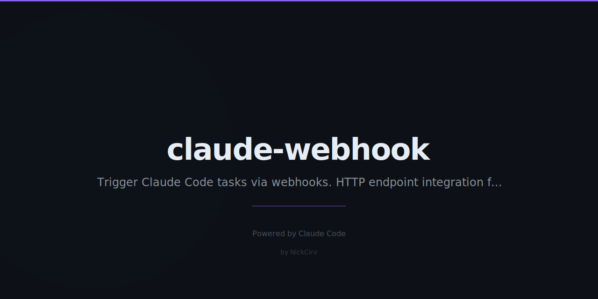

# claude-webhook

Trigger Claude Code tasks from webhooks. Connect Slack, GitHub, n8n, Zapier — anything that can send an HTTP request — to Claude.



## Install

```bash
npm install -g claude-webhook
# or run without installing
npx claude-webhook start
```

## Quick start

```bash
# Start the server
WEBHOOK_SECRET=mysecret claude-webhook start --port 3847

# In another terminal — run a task
curl -X POST http://localhost:3847/run \
  -H "Authorization: Bearer mysecret" \
  -H "Content-Type: application/json" \
  -d '{"task": "list all TODO comments in the repo", "cwd": "/path/to/repo"}'
```

## Endpoints

### `GET /status`

Server health check and recent execution history.

```bash
curl http://localhost:3847/status
```

Response:
```json
{
  "status": "ok",
  "version": "1.0.0",
  "startedAt": "2026-02-27T10:00:00.000Z",
  "uptime": 42.3,
  "recentExecutions": [
    {
      "id": "exec_1_1740650000000",
      "task": "fix the build",
      "cwd": "/path/to/repo",
      "source": "api",
      "status": "success",
      "startedAt": "2026-02-27T10:00:05.000Z",
      "completedAt": "2026-02-27T10:01:12.000Z",
      "durationMs": 67000,
      "stdout": "Fixed the failing test in src/auth.js...",
      "exitCode": 0
    }
  ]
}
```

---

### `POST /run`

Trigger an arbitrary Claude task. Auth via `Authorization: Bearer <WEBHOOK_SECRET>`.

```bash
# Basic task
curl -X POST http://localhost:3847/run \
  -H "Authorization: Bearer mysecret" \
  -H "Content-Type: application/json" \
  -d '{"task": "write a unit test for src/utils.js"}'

# With working directory
curl -X POST http://localhost:3847/run \
  -H "Authorization: Bearer mysecret" \
  -H "Content-Type: application/json" \
  -d '{
    "task": "refactor the database connection pool to use async/await",
    "cwd": "/Users/nick/repos/my-api"
  }'

# With custom timeout (ms)
curl -X POST http://localhost:3847/run \
  -H "Authorization: Bearer mysecret" \
  -H "Content-Type: application/json" \
  -d '{
    "task": "audit all dependencies for security vulnerabilities",
    "cwd": "/Users/nick/repos/my-api",
    "timeout": 600000
  }'
```

Response (202 Accepted — task runs async):
```json
{
  "accepted": true,
  "message": "Task queued — running Claude",
  "task": "write a unit test for src/utils.js",
  "cwd": "/Users/nick/repos/my-api"
}
```

Poll `GET /status` to see the result.

---

### `POST /webhook/github`

GitHub webhook handler. Listens for CI failures (`workflow_run` or `check_run` events with `conclusion: failure`) and auto-triggers Claude to investigate and fix.

Auth via `X-Hub-Signature-256` header (GitHub's HMAC-SHA256 format).

**GitHub setup:**
1. Go to your repo → Settings → Webhooks → Add webhook
2. Payload URL: `https://your-server.com/webhook/github`
3. Content type: `application/json`
4. Secret: your `WEBHOOK_SECRET`
5. Events: select `Workflow runs` and `Check runs`

```bash
# Simulate a GitHub CI failure webhook
curl -X POST http://localhost:3847/webhook/github \
  -H "Content-Type: application/json" \
  -H "X-GitHub-Event: workflow_run" \
  -H "X-Hub-Signature-256: sha256=$(echo -n '{"action":"completed","workflow_run":{"conclusion":"failure","head_branch":"main","html_url":"https://github.com/org/repo/actions/runs/123"}}' | openssl dgst -sha256 -hmac 'mysecret' | awk '{print $2}')" \
  -d '{
    "action": "completed",
    "workflow_run": {
      "conclusion": "failure",
      "head_branch": "main",
      "html_url": "https://github.com/org/repo/actions/runs/123"
    },
    "repository": {
      "full_name": "org/repo"
    }
  }'
```

Response:
```json
{
  "accepted": true,
  "event": "workflow_run",
  "repo": "org/repo",
  "branch": "main",
  "task": "CI failed on org/repo (branch: main). Run URL: https://... Investigate the failure, identify the root cause, and fix it. Run the tests to verify the fix works."
}
```

Non-failure events return `200 { skipped: true }` — safe to send all events.

---

### `POST /webhook/slack`

Slack slash command handler. Receives `/claude <task>` commands from Slack and runs them.

Auth via Slack's `X-Slack-Signature` HMAC header.

**Slack app setup:**
1. Create a Slack app at api.slack.com/apps
2. Add a Slash Command: `/claude`
3. Request URL: `https://your-server.com/webhook/slack`
4. Copy the Signing Secret → set as `WEBHOOK_SECRET`

```bash
# Simulate a Slack slash command (no auth — for local dev)
curl -X POST http://localhost:3847/webhook/slack \
  -H "Content-Type: application/x-www-form-urlencoded" \
  -d 'text=update the README with the new API endpoints&response_url=https://hooks.slack.com/commands/...'

# JSON format (for n8n / Zapier)
curl -X POST http://localhost:3847/webhook/slack \
  -H "Content-Type: application/json" \
  -d '{"text": "add error handling to the payment module", "response_url": ""}'
```

Slack receives an immediate `200` (within 3s deadline), then Claude posts the result back via `response_url` when done.

---

## CLI reference

```bash
# Start server
claude-webhook start [options]
  -p, --port <number>    Port to listen on (default: 3847, env: PORT)
  -s, --secret <string>  Webhook secret (default: env WEBHOOK_SECRET)
  -q, --quiet            Suppress request logs

# Check status of running server
claude-webhook status [options]
  -p, --port <number>    Port to check (default: 3847)
  -n, --limit <number>   Executions to display (default: 10)
```

## Environment variables

| Variable | Description |
|----------|-------------|
| `WEBHOOK_SECRET` | Shared secret for HMAC auth (required in production) |
| `PORT` | Default port (overridden by `--port`) |

## n8n / Zapier integration

Point an HTTP node at `POST /run` with:
```json
{
  "task": "{{ your task description }}",
  "cwd": "/path/to/repo"
}
```
Add header `Authorization: Bearer <WEBHOOK_SECRET>`.

## Security

- `/run` uses Bearer token auth (timing-safe comparison)
- `/webhook/github` uses HMAC-SHA256 (`X-Hub-Signature-256`)
- `/webhook/slack` uses Slack's HMAC-SHA256 + replay protection (5-minute window)
- Without `WEBHOOK_SECRET` set, auth is skipped — fine for local dev, not for production

## Architecture

```
bin/webhook.js        CLI entrypoint
src/index.js          Commander CLI (start / status commands)
src/server.js         Native http server + routing
src/handlers.js       Route handlers (/run, /webhook/github, /webhook/slack, /status)
src/executor.js       Claude CLI execution via execFile + in-memory history
src/auth.js           HMAC verification (GitHub, Slack, Bearer)
```

Zero runtime dependencies beyond `chalk` and `commander`. No Express.

## License

MIT
