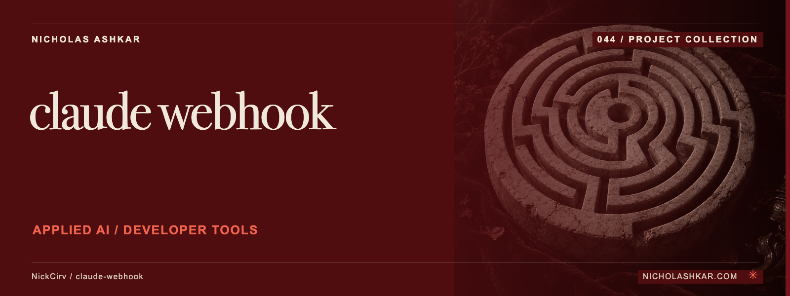

# claude-webhook

Exposes HTTP handlers that turn authenticated webhook requests into local Claude CLI tasks.


<a id="usage"></a>

<a id="trigger-a-claude-task-via-curl"></a>

<a id="check-server-status--recent-executions"></a>

<a id="cli-flags"></a>

<a id="environment-variables"></a>

<a id="endpoints"></a>

## What it does

- Generic task endpoint.
- GitHub and Slack signature handlers.
- Execution history.
- Status command.


<a id="install"></a>

<a id="start-the-webhook-server"></a>

## Quickstart

Prerequisites: Node.js `>=20` and npm. The checkout below pins the source used for this documentation.

```sh
git clone https://github.com/NickCirv/claude-webhook.git
cd claude-webhook
git checkout d8586b99705cbae9e72f2ca44834ae26aed2c0a6
npm install
node bin/webhook.js --help
```

**Expected behavior (illustrative, not captured):** Shows service commands before opening a listener or configuring WEBHOOK_SECRET.

Examples are source-inspected, **not runtime-tested**. See the research record for verification gaps.

## Boundaries and data

Execution runs Claude with local filesystem access. Source permits an empty secret configuration; configure authentication and network isolation before use. This repository is not reviewed as a public internet service.

## Development

The manifest defines `npm test` as:

```sh
node --test
```

The captured suite is a smoke check, not end-to-end behavior coverage. Examples include “entry is valid JavaScript”. Tests were not run for this documentation revision.

See [implementation and command reference](docs/REFERENCE.md) for the package scripts and inspected interfaces, and [research record](docs/RESEARCH.md) for the pinned source, document decisions and unresolved checks.

## License and contact

See [LICENSE](LICENSE) for the original terms and attribution. Legal text is unchanged.

[Nicholas Ashkar](https://nicholashkar.com/) · [Discuss a project](https://nicholashkar.com/#oxblood-contact)
